# Entity Relationship Diagram (ERD)

**Version:** 1.0  
**Generated:** 2026-01-10  
**Total Tables:** 350

---

## 📋 Overview

This document provides Entity Relationship Diagrams (ERDs) for the CEMS (Construction Enterprise Management System) database. Due to the large number of tables (350), the ERD is organized into logical modules.

---

## 🏗️ Core Architecture

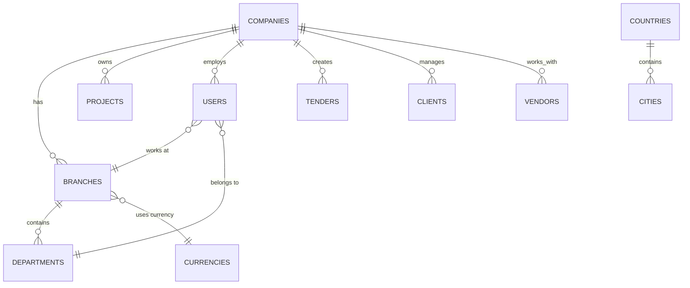

---

## 🎯 Module 1: Project Management

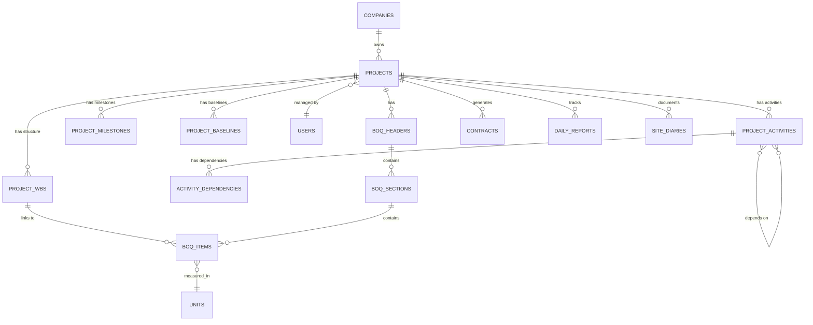

---

## 📋 Module 2: Tender Management

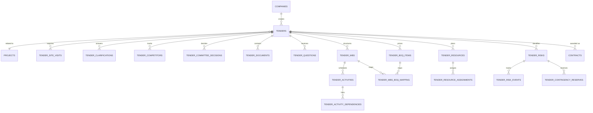

---

## 📊 Module 3: Contract Management

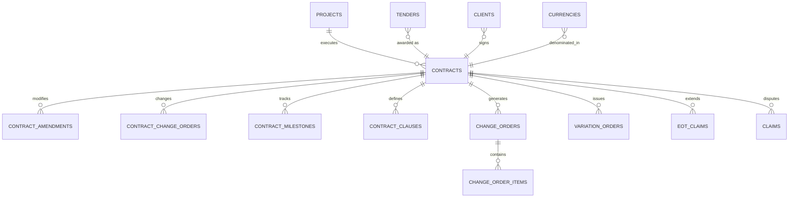

---

## 💰 Module 4: Financial Management

### Accounts Receivable (AR)

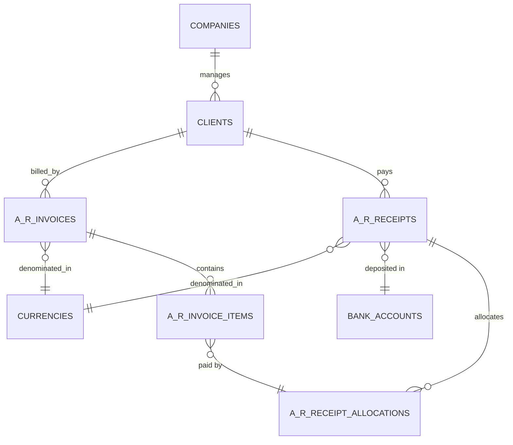

### Accounts Payable (AP)

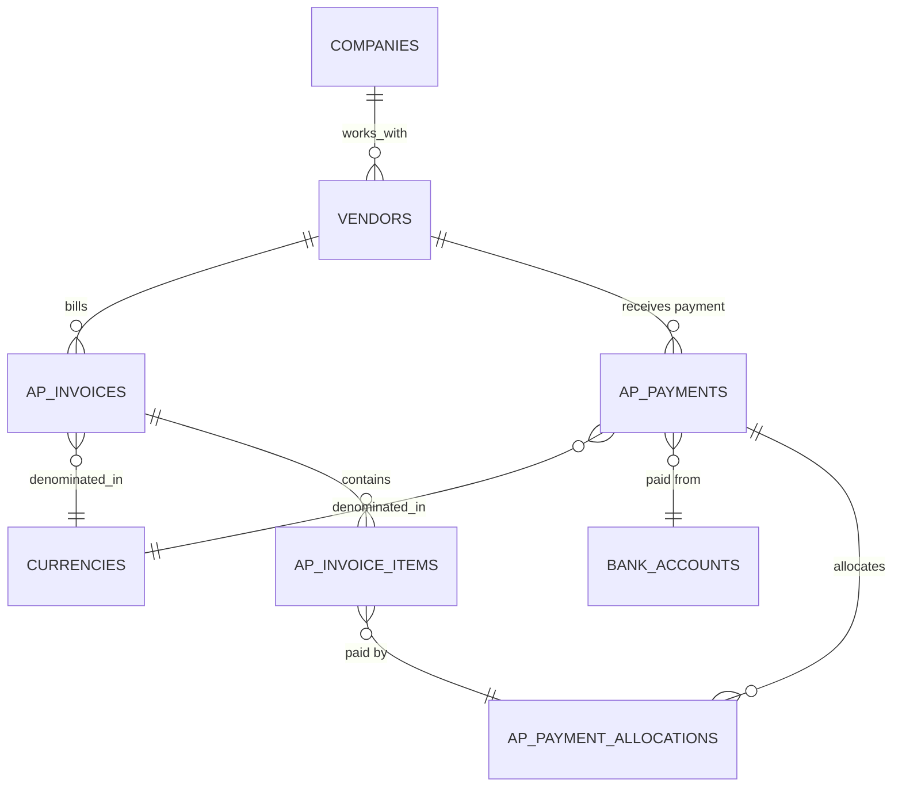

### General Ledger (GL)

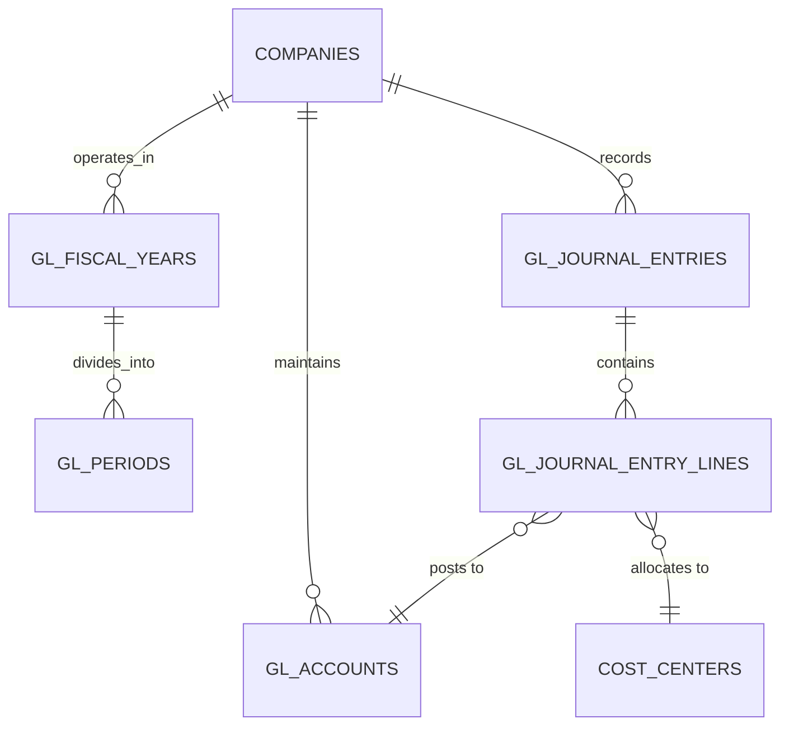

---

## 🔨 Module 5: Procurement & Inventory

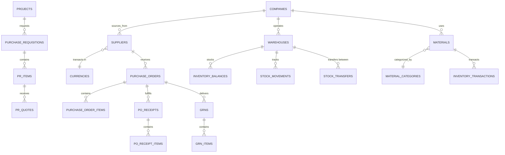

---

## 👷 Module 6: HR & Payroll

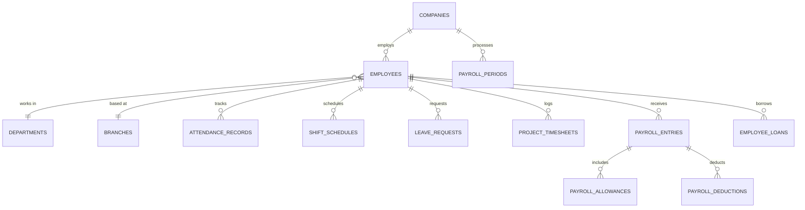

---

## ⚠️ Module 7: Risk Management

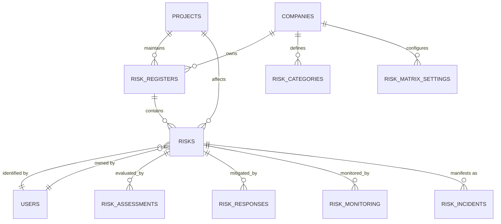

---

## 🏗️ Module 8: Subcontractor Management

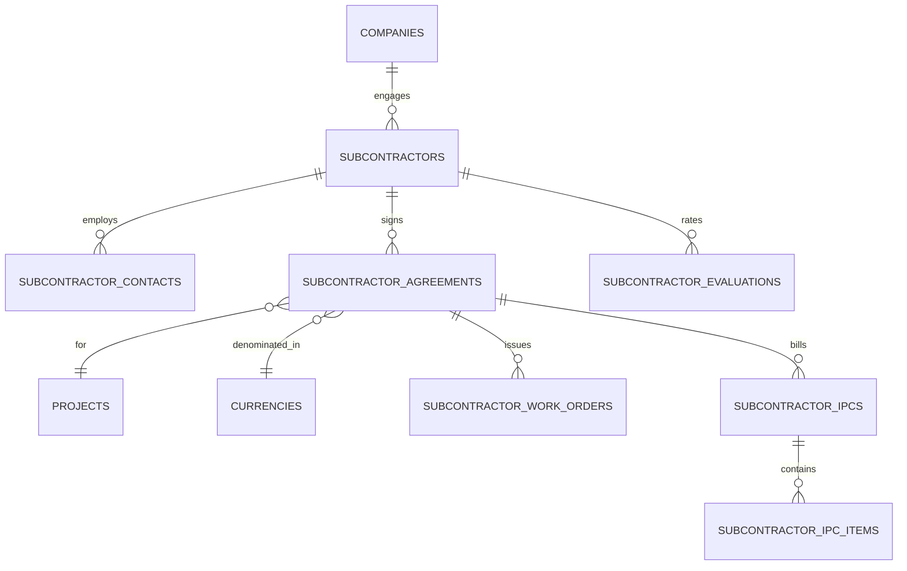

---

## 📦 Module 9: Equipment Management

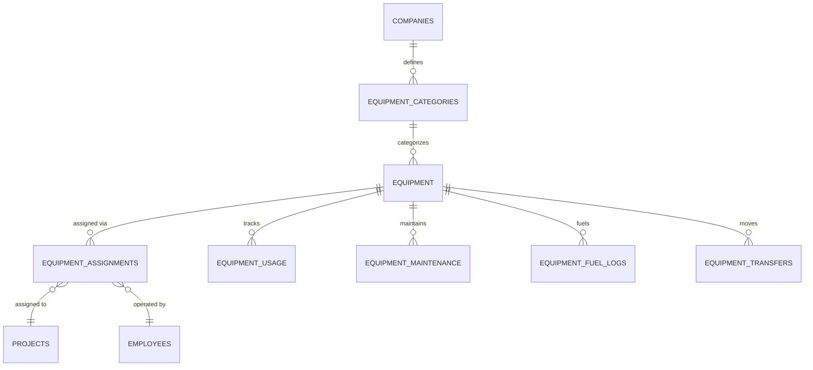

---

## 📝 Module 10: Site Documentation

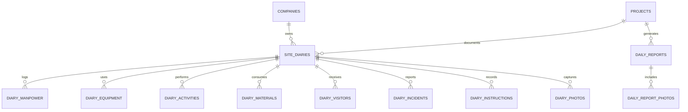

---

## 📸 Module 11: Photo Management

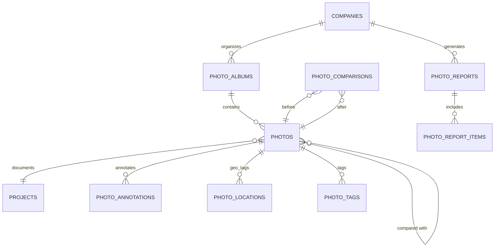

---

## 🔍 Module 12: Inspection & Quality

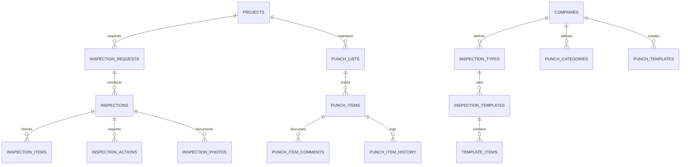

---

## 💼 Module 13: Correspondence

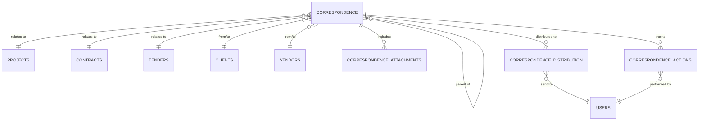

---

## 💵 Module 14: Progress Billing & Retention

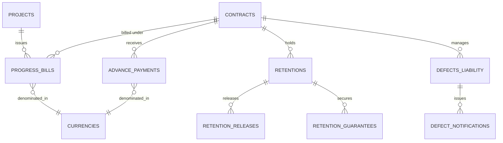

---

## 💰 Module 15: Project Cost Control

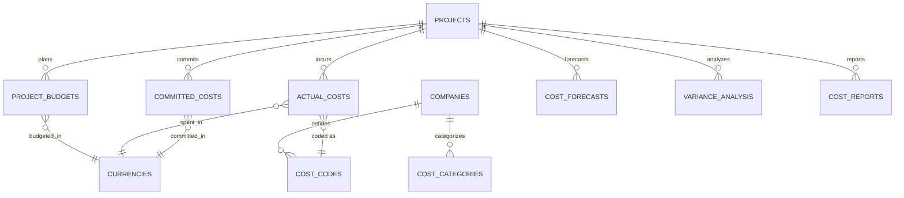

---

## 🏦 Module 16: Banking & Cash Management

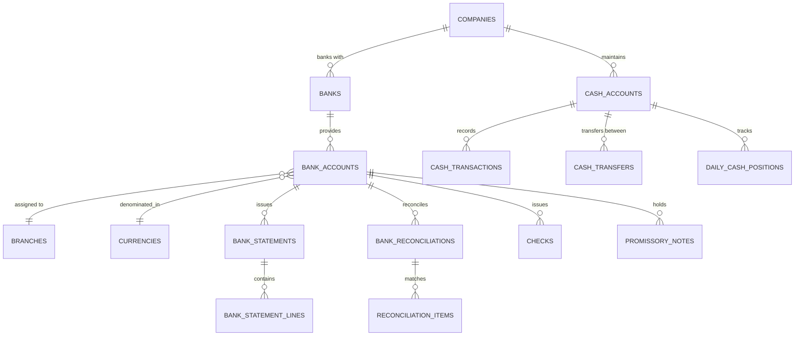

---

## 🏆 Module 17: Fixed Assets

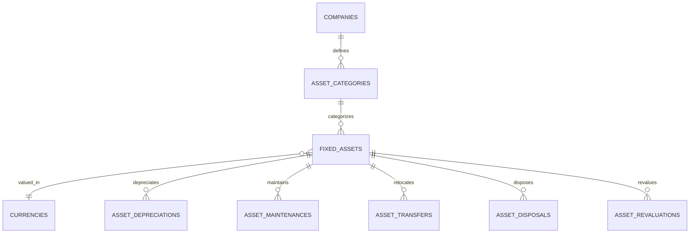

---

## 📊 Module 18: Guarantees

```mermaid
erDiagram
    PROJECTS ||--o{ GUARANTEES : requires
    GUARANTEES }o--|| CURRENCIES : valued_in
    GUARANTEES }o--|| BANKS : issued_by
    
    GUARANTEES ||--o{ GUARANTEE_RENEWALS : renews
    GUARANTEES ||--o{ GUARANTEE_RELEASES : releases
    GUARANTEES ||--o{ GUARANTEE_CLAIMS : claims
```

---

## 🔔 Module 19: Notifications

```mermaid
erDiagram
    COMPANIES ||--o{ NOTIFICATIONS : generates
    USERS }o--|| NOTIFICATIONS : receives
    
    COMPANIES ||--o{ ALERT_RULES : configures
    COMPANIES ||--o{ SCHEDULED_NOTIFICATIONS : schedules
```

---

## 📈 Module 20: Exchange Rates & Multi-Currency

```mermaid
erDiagram
    CURRENCIES ||--o{ EXCHANGE_RATES : "converted via"
    EXCHANGE_RATES }o--|| CURRENCIES : "from currency"
    EXCHANGE_RATES }o--|| CURRENCIES : "to currency"
    
    BRANCHES }o--|| CURRENCIES : "primary currency"
    CONTRACTS }o--|| CURRENCIES : "contract currency"
    INVOICES }o--|| CURRENCIES : "billed in"
```

---

## 📝 Key Relationships Summary

### Most Connected Tables

1. **companies** → 100+ child tables
2. **projects** → 80+ child tables  
3. **users** → 70+ child tables
4. **currencies** → 40+ child tables
5. **contracts** → 30+ child tables
6. **tenders** → 20+ child tables

### Common Patterns

```
1. Tenant Pattern: Most tables have company_id
2. Audit Pattern: Most tables have created_at, updated_at
3. Soft Delete: Many tables have deleted_at
4. User Tracking: created_by_id, approved_by_id
5. Status Enums: status field in most tables
```

---

## 🔧 Foreign Key Conventions

```sql
-- Standard Pattern
{singular_table}_id → BIGINT UNSIGNED
REFERENCES {plural_table}(id)
ON DELETE CASCADE/NULL/RESTRICT

-- Examples
company_id → companies(id) ON DELETE CASCADE
project_id → projects(id) ON DELETE CASCADE  
user_id → users(id) ON DELETE RESTRICT
currency_id → currencies(id) ON DELETE RESTRICT
```

---

## 📚 Related Documents

- `migration_dependencies.json` - Machine-readable dependency graph
- `NAMING_CONVENTIONS.md` - Naming standards
- `EXECUTION_PLAN.md` - Migration execution order

---

**Generated:** 2026-01-10  
**Total Tables:** 350  
**Total Foreign Keys:** 573  
**Maintained By:** CEMS Development Team
